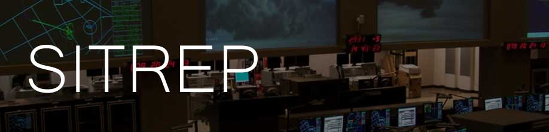
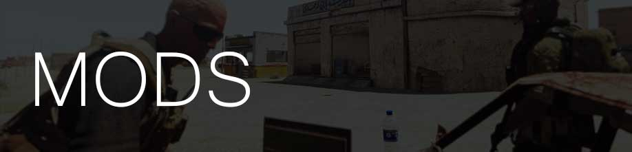

# Jigsaw - Parte 1
Quinto episódio da campanha em Esseker.

# 

Com a captura de documentos feitos dentro do celeiro, a equipe Kaiser tem agora novas informações sobre os Bratvas.  

Corona informou que a equipe de inteligência conseguiu identificar a cadeia de comando utilizada pela organização.  
Segundo Corona, os Bratvas são estruturados em células, cada uma com objetivos distintos e sem comunicação entre elas.  

Com o líder local morto na última missão, seria praticamente impossível identificar os outros membros da organização se não fosse por uma oportunidade única: medo.

Segundo Corona, um pedido feito para uma grande empresa de cofres, a Waltermann & Sons, levantou algumas bandeiras vermelhas no centro de inteligência AEGIS.
Utilizando contatos da Deep Web, nossos analistas conseguiram identficar o pedido inusitado feito de dentro da zona de contenção.

Nossa equipe externa em Londres adicionou um tracker GPS no pedido e Hannibal-6 conseguiu identificar que o pacote foi transportado até a Rússia por vias normais e contrabandeado para dentro da zona de contenção por membros do Bratva.

Segundo imagens via satélite, o dono do pedido é ninguém menos que Lyov Chechenko, um dos membros mais procurados do Bratva e dono de uma lista kilométrica de assassinatos durante a guerra fria. Acredita-se que Lyov é um ex membro do FSB, mas ninguém conseguiu provar essa ligação.

Conhecido por ser paranóico a níveis nada saudáveis, Corona acredita que ele é o líder da célula de Novi Grad e que o cofre é de fato de Lyov Chechenko, podendo conter informações sobre as outras células, já que o único link entre elas são seus líderes.

# SITUAÇÃO
Uma varredura pela região mostra um grande número de infantaria russa em Camp Spencer e Ingman Base. Corona assinalou no mapa a distância em que as patrulas se localizam. Infomações recentes mostram aeronaves rotativas no local, então mantenham distância.

Toda a áera industrial de Esseker é uma zona perigosa. Os Bratvas ainda estão em alerta graças a nossa última incursão no local.

Novi Grad é extremamente fortficada. Sua localização impede um ataque direto.  
Imagens via satélite mostram veículos leves e muita infantaria no local.

# MISSÃO
Corona identificou um modo de aproximação relativamente seguro.
Através de plantas antigas, foi possível identificar um sistema de esgoto que liga a zona industrial de Esseker até Novi Grad.  
Apesar de grande parte do sistema de esgoto estar inundado, Corona acredita que é possível utilizar parte dele através de uma entrada de serviço que fica próximo ao prédio central da Serralheria Pilana, designado aqui como Alpha.

Após utilizar os esgotos para entrar em Novi Grad, designado como Bravo, a equipe Kaiser deve se dirigir até o prédio central da cidade, designado como Golf e eliminar Lyov Chechenko.  

Ainda no local, a equipe deve utilizar o código de manutenção em seu cofre e coletar as informações sobre as outras células.  

Em seguida, todos devem retornar a base para relatório.

# EXECUÇÃO
1- Utilizar o sistema de esgoto em Alpha para ter acesso a Bravo.  
2- Localizar Lyov Chechenko e o cofre em Golf.  
3- Executar Lyov Chechenko.  
4- Utilizar o código **8856500676** no cofre e coletar informações.  
5- Extração até HQ.

# CALLSIGNS
**KAISER:** Equipe AEGIS  
**CORONA:** Comando AEGIS  
**ALPHA:** Serralheria Pilana  
**BRAVO:** Novi Grad  
**GOLF:** Localização de Lyov Chechenko e o cofre  

Boa sorte!

# 
Todos os mods abaixo são necessários para a campanha.
- [@ASR_AI3 - 0.9.1](http://www.armaholic.com/page.php?id=24080)
- [@ace3 - 3.4.1](https://github.com/acemod/ACE3/releases/)
- [@acre2 - 2.1.0.811](http://www.armaholic.com/page.php?id=19324)
- [@aegis - 0.7](https://github.com/aegisarma3/ASIN/releases/download/v0.7/aegis.zip)
- [@aegisremote - 0.1](https://github.com/aegisarma3/aegisremote/releases/download/v0.1/aegisremote.zip)
- [@cup_terrains - 1.0.1 Complete](http://cup-arma3.org/downloads/cup-terrains/)
- [@caf_ag - 1.5](http://www.armaholic.com/page.php?id=24441)
- [@caf_ag_audiopatch](http://www.armaholic.com/page.php?id=26326)
- [@cba_a3 - 2.3.1.160220](http://www.armaholic.com/page.php?id=18767)
- [@DAC - 3.1b](http://www.armaholic.com/page.php?id=25550)
- [@em - 0.63 beta](http://www.armaholic.com/page.php?id=27224)
- [@esseker - 0.72](https://mega.nz/#!CVwUxDZR!JZOghB0LME6OWTBIZPk3qAECcmUNvdnPYKfj19PX9Gw)
- [@melb - 0.00003](http://www.armaholic.com/page.php?id=28856)
- [@mrt_accfncs - 1.20](http://www.armaholic.com/page.php?id=26426)
- [@plp_containers - 0.7 beta](http://www.armaholic.com/page.php?id=29295)
- [@sma - 2.3](http://www.armaholic.com/page.php?id=26428)
- [@tryk - 0.9.4 beta](http://www.armaholic.com/page.php?id=26661)

## Mods utilizados no server:
- [@aegisserver - 0.2](https://github.com/aegisarma3/aegisserver/releases/download/v0.2/aegisserver.zip)
